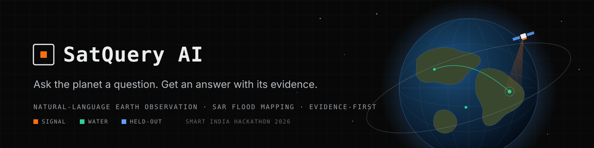
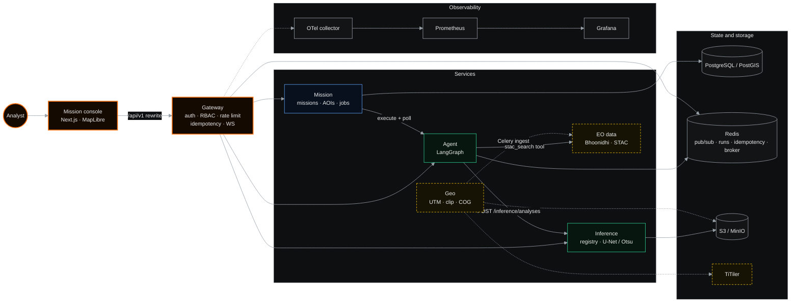
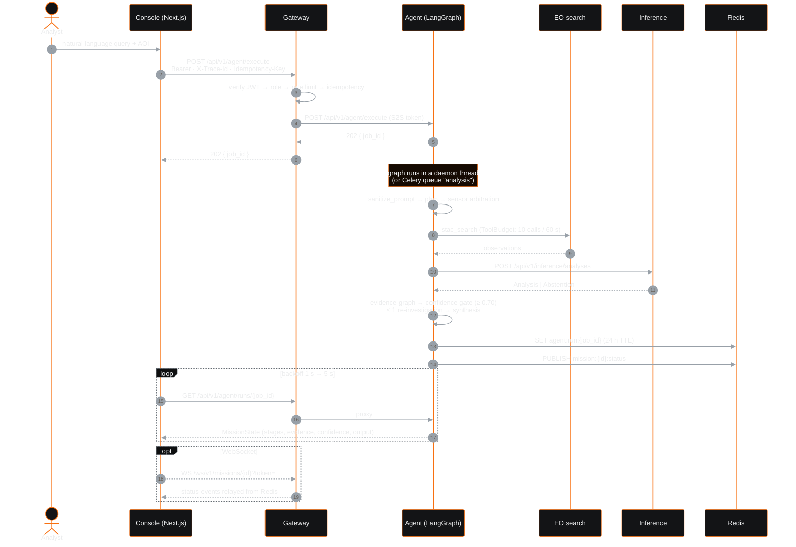
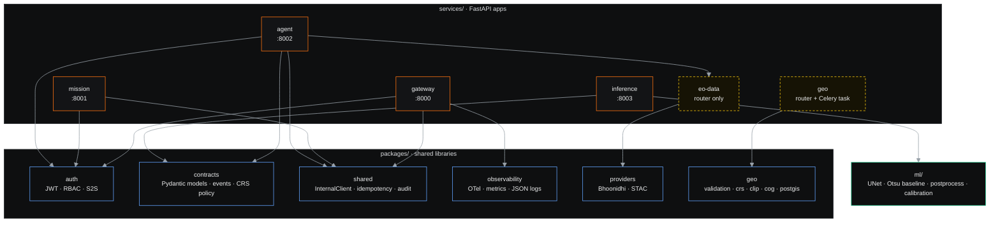
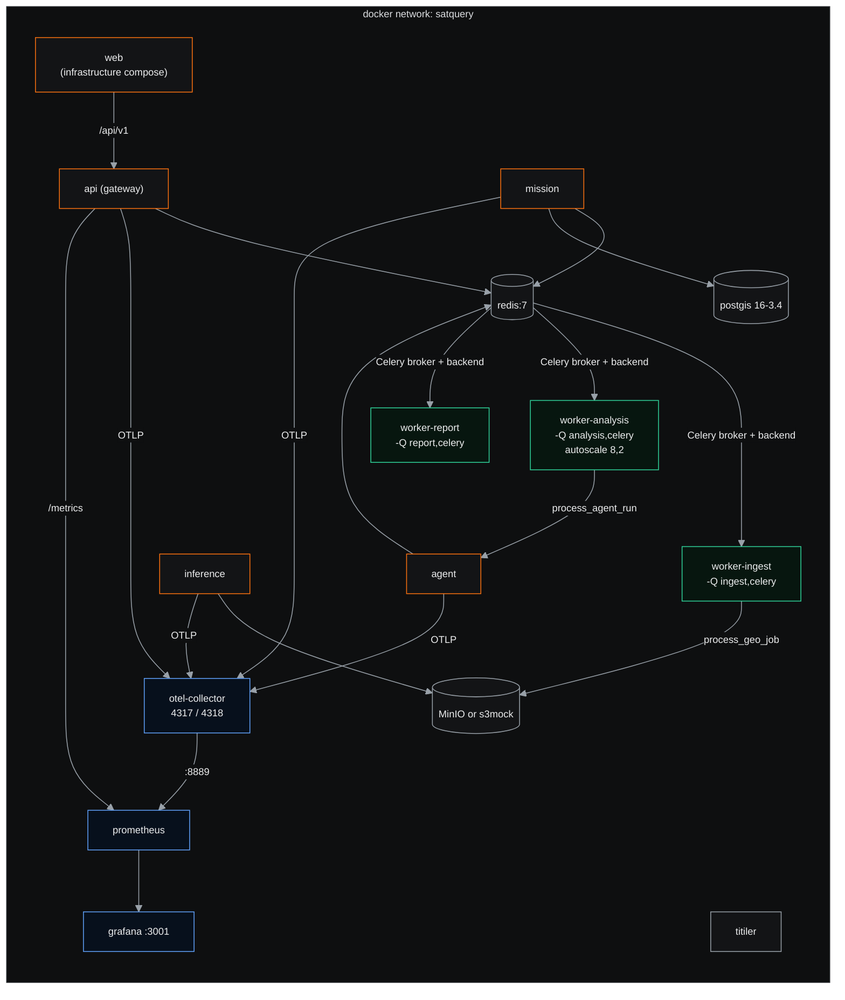
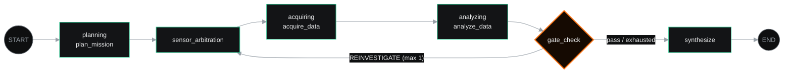
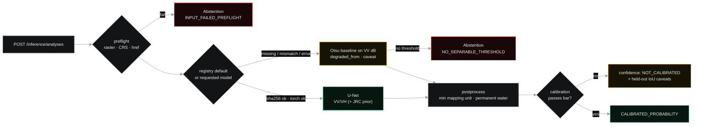
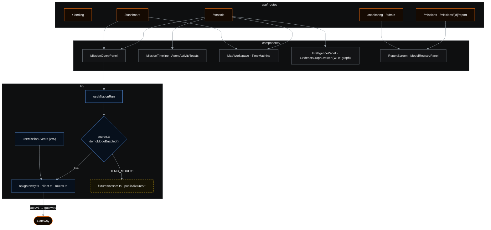

<div align="center">



<br />

**Natural-language Earth Observation for flood intelligence.**<br />
Ask a question about a place. An agent plans the mission, chooses the sensor, maps the water from Sentinel-1 radar, and answers with every figure tied to its evidence, or abstains.

<br />

[](https://github.com/KD4R/SatQuery/actions/workflows/ci.yml)


[What it is](#-what-is-satquery) ·
[Architecture](#-architecture) ·
[Agent](#-agent-architecture) ·
[Geospatial](#-geospatial-pipeline) ·
[ML](#-ml--inference) ·
[Frontend](#-frontend) ·
[Setup](#-local-setup) ·
[API](#-api-overview) ·
[Status](#-current-status--limitations)

<sub>Smart India Hackathon 2026</sub>

</div>

---

> [!IMPORTANT]
> **Read [Current status](#-current-status--limitations) before you demo or deploy this.** The architecture is implemented service by service and heavily tested, but the end-to-end path is not yet live. Provider access, trained weights and several UI panels still run on fixtures or labelled fallbacks. This README separates what runs from what is designed.

## ◉ What is SatQuery?

When a river breaks its banks, the people deciding where to send boats rarely have a GIS analyst to hand. They need to know **where the water is now**, **how sure we are**, and **why**. Optical satellites can't see through the cloud that comes with a flood, so the answer has to come from radar.

SatQuery turns that question into an **Earth Observation mission**. You write in plain language:

```text
Show flood-affected areas around Nagaon, Assam and explain why you chose SAR.
```

and the system:

1. **Plans.** It extracts the hazard, place and time window from the query, and sanitises it against prompt injection first.
2. **Arbitrates the sensor.** It picks SAR, optical or both from cloud cover, time of day and the hazard.
3. **Acquires.** It searches the EO catalogue (Bhoonidhi or STAC) for scenes over the AOI, within a tool-call budget.
4. **Analyses.** It runs flood segmentation on Sentinel-1 VV/VH. A U-Net is used when verified weights are present; otherwise a labelled Otsu baseline runs.
5. **Gates on confidence.** It builds an evidence graph, scores it, re-investigates once if the score is low, and **abstains** rather than guess.
6. **Synthesises.** It writes an answer that cites only nodes in the evidence graph. The language model coordinates; it is never the source of a figure.

The console shows each stage as it lands: timeline, map layers, the *why* graph, confidence, and a report. Every value is marked with its source.

## ◉ System at a glance

SatQuery is a Python monorepo of FastAPI services behind a single gateway, with a Next.js mission console in front.

| Layer | Where | Role |
|---|---|---|
| **Console** | `apps/web` | Next.js 15 App Router, MapLibre map, evidence and intelligence panels, typed gateway client, deterministic demo mode |
| **Edge** | `services/gateway` | JWT auth, RBAC, rate limiting, CORS, security headers, idempotency, proxying, mission WebSocket |
| **Mission** | `services/mission` | Mission, AOI and job lifecycle over SQLAlchemy (PostgreSQL in Compose) |
| **Agent** | `services/agent` | LangGraph state machine: plan, arbitrate, acquire, analyse, gate, synthesise |
| **EO data and geo** | `services/eo-data`, `services/geo`, `packages/providers`, `packages/geo` | Provider adapters, AOI validation, UTM reprojection, clipping, COG writing, TiTiler routes |
| **Inference** | `services/inference`, `ml/` | Model registry, checksum-verified loading, U-Net or Otsu baseline, calibrated-or-not confidence, abstention |
| **Contracts** | `packages/contracts` | Frozen Pydantic models shared across services (`Observation`, `Analysis`, `Abstention`, events) |
| **Platform** | `infrastructure/`, `.github/workflows` | Docker, Celery workers, OpenTelemetry, Prometheus, Grafana, CI, image release |

## ◉ Architecture

### High-level architecture



<sub>Solid lines are wired in code. Dashed lines and amber nodes are implemented as libraries or routers but <b>not yet deployed on the request path</b> (see <a href="#-current-status--limitations">status</a>).</sub>

### End-to-end request flow

The console's live mode drives the agent through the gateway and polls the run. The mission service offers the same run through `POST /missions/{id}/runs`.



### Backend services



`.importlinter` enforces the layering (**services → ml → packages**) and keeps agent, gateway, geo, inference and mission independent of one another. Services talk over HTTP through `InternalClient` (httpx, 5 s timeout, 3 retries with backoff, an in-process circuit breaker and a fresh S2S token per call). They never import each other.

### Infrastructure and async workers



Celery (`services/celery_orchestrator.py`) routes `services.geo.implementation.process_geo_job` to `ingest` and `services.agent.worker.process_agent_run` to `analysis`. The `report` worker is provisioned but has no task routed to it yet. `CELERY_TASK_ALWAYS_EAGER=true` runs tasks inline, and the test suite does that by default. The `titiler` container is up but nothing requests tiles from it yet.

## ◉ Agent architecture

The agent is a compiled LangGraph `StateGraph` over a Pydantic `MissionState` (`services/agent/graph/orchestrator.py`, `services/agent/schemas.py`).



`MissionState` carries the run: `mission_id`, `run_id`, `organization_id`, `job_id`, `trace_id`, `query` and `sanitized_query`, `status`, `intent`, `aoi`, `temporal_window`, `selected_sensors`, `observation_ids`, `tool_calls`, `evidence_graph`, `confidence_score`, `uncertainty_reasons`, `synthesized_output`, `errors` and `metadata`.

| Node | What the code does |
|---|---|
| **Pre-run** | `sanitize_prompt` rejects queries over 4,000 chars or containing null bytes, and blocks 8 injection patterns (ignore/disregard previous instructions, system-prompt override, DAN, developer mode, ChatML and `[INST]` tokens and others) with HTTP 400. AOI GeoJSON is validated (max nesting depth 4) and the hazard is checked against an allowlist. |
| **planning** | `extract_intent_and_plan` runs `PromptTemplate → ChatOpenAI("gpt-4o-mini") → PydanticOutputParser` when `OPENAI_API_KEY` is set, and keyword heuristics (default hazard: flood) when it isn't or the call fails. |
| **sensor_arbitration** | Rule-based (`nodes/sensor_arbitrator.py`): night → SAR only. Cloud > 20% → SAR primary, plus optical if cloud < 60%. Flood with accuracy priority → SAR + optical. Otherwise optical primary, SAR secondary. A secondary sensor emits a `SENSOR_DISAGREEMENT` event. |
| **acquiring** | Calls the `stac_search` tool through the tool executor. Access is checked role → tool tier, and each call is charged to a `ToolBudget` (default 10 calls / 60 s; server ceiling 50 / 300 s). The registry holds `stac_search` and `asset_selector`. |
| **analyzing** | Posts the scene to inference over `InternalClient` with scope `inference:run`. |
| **gate_check** | `EvidenceGraphBuilder` links **observation → inference → metric** nodes. `evaluate_confidence_gate` starts from 0.95, subtracts penalties for optical cloud > 15%, resolution > 20 m and temporal lag > 14 days, averages with model confidence, and passes at **≥ 0.70**. A failed gate re-runs arbitration once. |
| **synthesize** | Aborts with `FAILED` if confidence < 0.6. Otherwise it produces a **templated** answer (no LLM) whose citations are the evidence-graph node IDs. |

**Run state** is written to Redis as `agent:run:{job_id}` (24 h TTL) with a process-local cache, so the API process, a Celery worker, the mission poller and the gateway WebSocket all see the same run. Progress events are published on `mission:{id}:status`. Event text comes from fixed templates, never from query-derived strings.

> [!NOTE]
> Built but not yet wired into the graph: `AutonomousAcquisitionLoop` (up to 3 iterations towards 0.70), temporal planning and `analyze_sensor_disagreement`. `demo_profile.run_pinned_demo_profile` replays a pinned Assam mission through the real graph, and only tests call it.

## ◉ Geospatial pipeline

| Stage | Implementation | Notes |
|---|---|---|
| **AOI (console)** | `apps/web/lib/geo/validate.ts` | Area 0.5–50,000 km², closed rings, in-bounds coordinates, no self-intersection, no antimeridian crossing, vertex cap |
| **AOI (backend)** | `packages/geo/validation.py`, mission `schemas.py` | GeoJSON structure plus Shapely `is_valid`, with a complexity cap. EPSG:4326 is assumed. There is no server-side area limit yet. |
| **Catalogue search** | `packages/providers/bhoonidhi.py`, `packages/providers/stac.py`, `services/eo-data` | Bhoonidhi: token auth cached in Redis (with lock and login budget), CQL2 search, offline-product tagging, streamed download to S3. STAC: `pystac-client` against Planetary Computer. Results cached in Redis for 1 h. |
| **Raster validation** | `packages/geo/raster.py` | rasterio with hardened GDAL settings, ≥ 1 band, ≤ 30,000 px per side |
| **CRS normalisation** | `packages/geo/crs.py`, `packages/contracts/crs_policy.py` | UTM zone picked from the raster centre, reprojected with rasterio. Only UTM EPSG codes count as area-safe, and `Measurement` refuses anything else. |
| **Clip** | `packages/geo/clipping.py` | AOI reprojected with pyproj and Shapely, then cropped with `rasterio.mask` |
| **COG** | `packages/geo/cog.py` | `gdaladdo` overviews (2 to 32), then `gdal_translate -of COG` with DEFLATE |
| **AOI persistence** | `packages/geo/postgis.py` | `insert_aoi` into PostGIS with a row-level-security context |
| **Tiles** | `services/geo/api.py`, `titiler` container | TiTiler's COG routes mounted under `/api/v1/tiles`, plus a standalone `titiler` service in Compose |
| **Map** | `apps/web/components/map/MapWorkspace.tsx` | MapLibre on a deliberately empty dark style (no basemap), with raster image overlays, a GeoJSON change layer, AOI and draw layers, and the Before/After/Change **Time Machine** crossfade |

The pipeline runs as the Celery task `process_geo_job` on the `ingest` queue: **validate → reproject → clip → COG**. SAR preprocessing (calibration, speckle filtering, dB conversion) is not in `packages/geo`. Training and evaluation chips come from Sen1Floods11 already in dB (`fetch_sen1floods11.py`).

## ◉ ML / inference



- **Registry** (`services/inference/registry.py`) discovers `$SATQUERY_MODEL_ROOT/<name>/best.pt` with its `metrics.json` and `calibration.json`, and reads manifests from `$SATQUERY_MANIFEST_ROOT/<name>/manifest.json`. The default model is the one with the highest validation IoU **among those that beat their baseline**. If none does, the baseline serves.
- **Loading.** The sha256 from the manifest is checked **before** torch is imported. Weights load with `torch.load(weights_only=True)`. `SATQUERY_REQUIRE_MANIFEST=1` refuses unmanifested weights; otherwise they load with `checksum_verified=false` and a caveat. `ml/scripts/fetch_model.py` fetches and verifies weights. There is no signature verification.
- **Degraded, never silent.** Any load or inference failure falls back to the Otsu baseline. The response carries `degraded_from` and a `degraded: <reason>` caveat. Every result is an `Analysis` or an `Abstention` (`packages/contracts/ml.py`).
- **Model.** `ml/models/unet.py` defines a small `UNet`. The committed manifest `infrastructure/models/hand-only-v2/manifest.json` records its architecture, preprocessing, checksums and calibration. **Weights are not committed**, so a fresh checkout serves the baseline.

**Evaluation**, quoted verbatim from the generated [`reports/evaluation.md`](reports/evaluation.md), which CI checks for staleness with `ml/scripts/check_report_fresh.py`. Held out **India, Somalia**: 92 chips never seen in training. Split by region, not by chip.

| method | pooled IoU | pooled F1 | mean per-chip IoU | mean per-chip F1 |
|---|---|---|---|---|
| deterministic baseline | 0.204 | 0.339 | 0.209 | 0.289 |
| hand-only-v2 | **0.435** | **0.606** | 0.254 | 0.348 |

> [!WARNING]
> **No accuracy figure is reported for this task.** Water is a minority class, so a model that predicts no water anywhere still scores high "accuracy". The report explains why IoU and F1 are the metrics.
>
> **Confidence is not calibrated.** From [`reports/calibration.md`](reports/calibration.md): temperature scaling reaches ECE **0.0583 against a bar of 0.05**, a FAIL. Results ship as `NOT_CALIBRATED`.

## ◉ Frontend

`apps/web`: Next.js 15 (App Router, `output: "standalone"`), React 19, TypeScript 5, MapLibre GL 6, framer-motion, `@xyflow/react`, `d3-geo`, Turf, OGL and three.js for the landing effects.



- **Typed gateway client** (`lib/api/`). Hand-written, and contract-tested against `docs/openapi/gateway.json`. It only calls the same-origin base `NEXT_PUBLIC_GATEWAY_URL` (default `/api/v1`) and refuses absolute URLs. It sends `X-Trace-Id` and an optional `Idempotency-Key`. The bearer token is kept **in memory only**. Timeout 15 s; 3 attempts with 250/750 ms backoff on network errors and 5xx.
- **Mission console** (`/console`). Query panel, 9-stage timeline, live agent toasts, MapLibre workspace with observation/baseline/change/confidence/AOI toggles, the Time Machine, the intelligence panel (confidence band, gate, uncertainty) and the xyflow **WHY graph**.
- **Provenance in the UI.** Every value is wrapped as `Sourced` with a `gateway` or `fixture` badge, and the telemetry bar reads `ENV: DEMO` or `ENV: LIVE`. Fixtures are **never** used as a fallback for a failed live call.
- **Demo mode.** With `NEXT_PUBLIC_DEMO_MODE=1` (baked in at build time), every panel is fed the pinned Assam/Nagaon scenario from `lib/fixtures/` and `public/fixtures/`, on pinned timings, with a visible **DEMO FIXTURE** badge.

<details>
<summary><b>Design language</b></summary>

<br />

The console is a dark mission-control surface: flat grounds, 1 px rules instead of shadows, one warm signal colour for what you can act on, and two cool data colours.


Type: **Chakra Petch** (display and body), **Share Tech Mono** (telemetry and data), **Pixelify Sans** (wordmark only). Tokens live in `components/landing/space.css` and `app/globals.css`. The older console stylesheet `app/mission.css` still carries its own red/Inter/IBM Plex palette.

</details>

## ◉ Repository structure

```text
SatQuery/
├── apps/web/                  Next.js mission console, landing, dashboard (P5)
│   ├── app/                   App Router routes
│   ├── components/            console · map · evidence · report · landing
│   ├── lib/                   api client · ws · geo validation · fixtures
│   └── e2e/                   Playwright specs
├── services/
│   ├── gateway/               edge: auth, RBAC, rate limit, proxy, WS (P1)
│   ├── mission/               missions, AOIs, jobs (P1)
│   ├── agent/                 LangGraph orchestration, tools, evals (P2)
│   ├── inference/             registry, model serving, confidence (P3)
│   ├── eo-data/               catalogue search, asset resolution (P4)
│   ├── geo/                   raster pipeline, TiTiler routes (P4)
│   └── celery_orchestrator.py Celery app and queue routing
├── packages/
│   ├── auth/  contracts/  shared/  observability/  providers/  geo/
├── ml/                        UNet, SAR baseline, training, evaluation, scripts (P3)
├── data/fixtures/             pinned provider responses for tests
├── reports/                   generated evaluation and calibration reports
├── infrastructure/
│   ├── docker/                Dockerfile, compose, OTel, Prometheus, Grafana
│   ├── models/                model manifests (weights fetched by checksum)
│   ├── release/  scripts/     release manifest helpers, rollback.sh
├── docs/
│   ├── adr/                   architecture decision records
│   └── openapi/               gateway · mission · agent · inference specs
├── prds/                      per-track PRDs, current-status and future-work notes
├── tests/                     unit · integration · contracts · security · perf · chaos · e2e
├── docker-compose.yml         root stack (s3mock, no web)
└── .github/workflows/         ci · cd · pr-validation
```

## ◉ Technology stack

| Area | Technologies in the code |
|---|---|
| Frontend | Next.js 15, React 19, TypeScript 5, MapLibre GL 6, framer-motion, @xyflow/react, d3-geo, Turf, OGL, three.js, Tailwind (landing) |
| Services | Python 3.10, FastAPI, Pydantic v2, pydantic-settings, httpx, tenacity, uvicorn |
| Agent | LangGraph, LangChain Core, LangChain OpenAI (`gpt-4o-mini`, optional) |
| Geospatial | rasterio / GDAL, Shapely, pyproj, pystac-client, TiTiler, PostGIS, GeoAlchemy2 |
| ML | PyTorch (optional `requirements-ml.txt`), NumPy, SciPy |
| Data and async | PostgreSQL 16 + PostGIS 3.4, SQLAlchemy (async, asyncpg), Redis 7, Celery, boto3, MinIO / s3mock |
| Auth | python-jose (HS256 dev, RS256 + JWKS prod) |
| Observability | OpenTelemetry SDK + collector, prometheus-client, Prometheus 2.54, Grafana 11 |
| Quality | pytest, Vitest, Playwright, black, flake8, mypy, import-linter, bandit, oasdiff |

## ◉ Local setup

**Prerequisites:** Python 3.10, Node.js 20+ and npm, Docker with Compose v2, and GDAL system libraries if you run raster code outside Docker.

### 1. Console only (demo mode, no backend)

The fastest way to see the product. Everything runs from pinned fixtures and is badged as such.

```bash
git clone https://github.com/KD4R/SatQuery.git
cd SatQuery/apps/web
npm ci
cp .env.example .env.local
echo "NEXT_PUBLIC_DEMO_MODE=1" >> .env.local
npm run dev            # http://localhost:3000  →  /console
```

### 2. Full stack with Docker Compose

There are two Compose files. **`infrastructure/docker/docker-compose.yml` is the complete one**: MinIO, the `web` service, and inference built with CPU PyTorch (`INSTALL_ML=1`). The test harness and `rollback.sh` use it too.

```bash
cd infrastructure/docker
cp .env.example .env
# the template starts with a literal "[TEMPLATE]" line — delete it, then:
echo "AUTH_SECRET_KEY=$(openssl rand -hex 32)" >> .env     # required, compose refuses to start without it
docker compose up -d --build
docker compose ps
```

| Service | URL |
|---|---|
| Console | http://localhost:3000 |
| Gateway | http://localhost:8000/api/v1/health · `/metrics` |
| Mission / Agent / Inference | :8001 · :8002 · :8003 (`/api/v1/health`) |
| TiTiler | http://localhost:8081 |
| MinIO console | http://localhost:9001 |
| Prometheus / Grafana | http://localhost:9090 · http://localhost:3001 |

The root `docker-compose.yml` is a lighter variant: `adobe/s3mock` instead of MinIO, no `web` service, inference without torch, and a hard-coded development HS256 secret.

To serve a trained model, place `best.pt` with its sidecars under `artifacts/<name>/` (for example via `ml/scripts/fetch_model.py`). The checksum must match `infrastructure/models/<name>/manifest.json`.

### 3. Services without Docker

```bash
python3.10 -m venv .venv && source .venv/bin/activate
pip install -r requirements.txt          # add -r requirements-ml.txt for torch

export AUTH_ALGORITHM=HS256 AUTH_SECRET_KEY=dev-only-secret
PYTHONPATH=. uvicorn services.gateway.implementation:app   --port 8000 --reload
PYTHONPATH=. uvicorn services.mission.implementation:app   --port 8001 --reload   # SQLite by default
PYTHONPATH=. uvicorn services.inference.implementation:app --port 8003 --reload

# the agent imports services.eo_data (the directory is services/eo-data);
# the alias lives in infrastructure/docker/sitecustomize.py
SATQUERY_REPO_ROOT=$PWD PYTHONPATH=.:infrastructure/docker \
  uvicorn services.agent.app.api.implementation:app --port 8002 --reload
```

For a live console, point the Next.js rewrite at your gateway: `GATEWAY_ORIGIN=http://localhost:8000 npm run dev`. Then paste a JWT on `/admin`. The client keeps it in memory only.

## ◉ Environment variables

Templates: [`infrastructure/docker/.env.example`](infrastructure/docker/.env.example) and [`apps/web/.env.example`](apps/web/.env.example). The templates hold development defaults only. Real secrets belong in your own `.env`, which is gitignored.

<details>
<summary><b>Variables read by the code</b></summary>

<br />

| Variable | Read by | Purpose |
|---|---|---|
| `AUTH_ALGORITHM` | `packages/auth` | `RS256` (default, JWKS) or `HS256` |
| `AUTH_SECRET_KEY` | `packages/auth` | HS256 signing secret; also signs S2S tokens. **Required** by the infrastructure compose. |
| `AUTH_JWKS_URL`, `AUTH_REQUIRE_HTTPS` | `packages/auth` | RS256 key set (HTTPS enforced unless `0`) |
| `AUTH_ISSUER`, `AUTH_AUDIENCE` | `packages/auth` | Checked when set |
| `CORS_ALLOW_ORIGINS` | gateway | Comma-separated allowlist; empty means deny |
| `RATE_LIMIT_REQUESTS`, `RATE_LIMIT_WINDOW_S` | gateway | Sliding window per client IP (defaults 100 / 60 s) |
| `TRUST_PROXY_HEADERS` | gateway | Honour `X-Forwarded-For` |
| `MISSION_SERVICE_URL`, `AGENT_SERVICE_URL`, `INFERENCE_SERVICE_URL`, `INFERENCE_TIMEOUT_S` | gateway, mission, agent | Downstream service locations |
| `DATABASE_URL` | mission, providers | SQLAlchemy URL (mission defaults to `sqlite+aiosqlite:///./mission.db`) |
| `SATQUERY_SKIP_DB_INIT` | mission, geo | Skip `create_all` / PostGIS pool |
| `REDIS_URL` | gateway, agent, providers, Celery | Pub/sub, run state, idempotency, broker |
| `CELERY_TASK_ALWAYS_EAGER` | Celery | Run tasks inline |
| `S3_ENDPOINT`, `S3_BUCKET`, `S3_ACCESS_KEY`, `S3_SECRET_KEY` | inference, providers | Object storage |
| `SATQUERY_ARTIFACT_DIR` | inference | Local artifact store instead of S3 |
| `SATQUERY_MODEL_ROOT`, `SATQUERY_MANIFEST_ROOT`, `SATQUERY_REQUIRE_MANIFEST`, `SATQUERY_DATA_ROOT` | inference | Model discovery, manifest enforcement, raster root |
| `OPENAI_API_KEY` | agent | Enables LLM intent extraction; heuristics without it |
| `BHOONIDHI_USERNAME`, `BHOONIDHI_PASSWORD`, `BHOONIDHI_API_URL` | providers | Bhoonidhi catalogue access |
| `OTEL_EXPORTER_OTLP_ENDPOINT`, `OTEL_CONSOLE_EXPORTER`, `OTEL_SERVICE_NAME` | observability | Trace export (none when unset) |
| `NEXT_PUBLIC_GATEWAY_URL` | web | Same-origin API base (default `/api/v1`) |
| `NEXT_PUBLIC_DEMO_MODE` | web (build time) | `1` = deterministic fixture mode |
| `GATEWAY_ORIGIN` / `API_URL` / `NEXT_PUBLIC_API_URL` | web `next.config.ts` | Rewrite target for `/api/v1/*` |
| `POSTGRES_*`, `MINIO_*`, `GRAFANA_PASSWORD`, `*_PORT` | compose | Container credentials and host ports |

</details>

## ◉ API overview

All routes are versioned under `/api/v1`. OpenAPI specs for each service are in [`docs/openapi/`](docs/openapi). Unless noted, routes need a bearer JWT carrying `sub` and `org_id`. Roles rank `viewer < analyst < operator < admin < system`.

<details open>
<summary><b>Gateway</b> · <code>services.gateway.implementation:app</code> · the public surface</summary>

<br />

| Method | Path | Upstream |
|---|---|---|
| `GET` | `/api/v1/health` · `/metrics` | gateway |
| `GET` `POST` | `/api/v1/missions` | mission |
| `GET` `PATCH` `DELETE` | `/api/v1/missions/{id}` | mission |
| `POST` | `/api/v1/missions/{id}/runs` | mission |
| `GET` | `/api/v1/jobs/{job_id}` | mission |
| `POST` | `/api/v1/agent/plan` · `/execute` · `/sensor-decision` · `/confidence` | agent |
| `GET` | `/api/v1/agent/runs/{job_id}` · `/agent/tools` | agent |
| `POST` | `/api/v1/inference/analyses` | inference |
| `GET` | `/api/v1/inference/models` | inference |
| `GET` | `/api/v1/inference/analyses/{trace_id}/extent` | inference (GeoJSON) |
| `WS` | `/ws/v1/missions/{mission_id}?token=` | Redis `mission:{id}:status` |

</details>

<details>
<summary><b>Mission</b> · <code>services.mission.implementation:app</code></summary>

<br />

| Method | Path | Role |
|---|---|---|
| `POST` / `GET` | `/api/v1/missions` (list: `limit` 1–200, `offset`) | analyst / viewer |
| `GET` `PATCH` `DELETE` | `/api/v1/missions/{id}` | viewer / operator / admin |
| `POST` / `GET` | `/api/v1/aois` | analyst / viewer |
| `GET` `DELETE` | `/api/v1/aois/{id}` | viewer / operator |
| `POST` | `/api/v1/missions/{id}/runs` → 202 | operator |
| `GET` | `/api/v1/jobs/{id}` | viewer |
| `PATCH` | `/api/v1/jobs/{id}/agent-status` | system |
| `GET` | `/api/v1/health` | none |

AOI routes are served by the mission service but **not proxied by the gateway**.

</details>

<details>
<summary><b>Agent</b> · <code>services.agent.app.api.implementation:app</code></summary>

<br />

| Method | Path | Notes |
|---|---|---|
| `POST` | `/api/v1/agent/plan` | intent + plan |
| `POST` | `/api/v1/agent/execute` | 202, runs the graph in the background |
| `GET` | `/api/v1/agent/runs/{job_id}` | `MissionState` |
| `POST` | `/api/v1/agent/sensor-decision` | arbitration only |
| `POST` | `/api/v1/agent/confidence` | gate only |
| `GET` | `/api/v1/agent/tools` | registered tools |
| `GET` | `/api/v1/health` | none |

</details>

<details>
<summary><b>Inference</b> · <code>services.inference.implementation:app</code></summary>

<br />

| Method | Path | Notes |
|---|---|---|
| `POST` | `/api/v1/inference/analyses` | analyst; returns `Analysis` or `Abstention` (HTTP 200) |
| `GET` | `/api/v1/inference/models` | viewer; model cards and the current default |
| `GET` | `/api/v1/inference/analyses/{trace_id}/extent` | stored extent GeoJSON (404 / 503) |
| `GET` | `/api/v1/health` | liveness only |

</details>

<details>
<summary><b>EO data and geo routers</b> (implemented, not mounted in a deployed app)</summary>

<br />

| Method | Path | Router |
|---|---|---|
| `POST` | `/api/v1/observations/search` | `services/eo-data/api.py` |
| `POST` | `/api/v1/monitoring/latest-cloud-free` | `services/eo-data/api.py` |
| `POST` | `/api/v1/assets/resolve` | `services/eo-data/api.py` |
| `POST` | `/api/v1/geo/jobs` → 202 (needs `Idempotency-Key`) | `services/geo/api.py` |
| `GET` | `/api/v1/tiles/*` (TiTiler COG routes) | `services/geo/api.py` |

</details>

## ◉ Testing

| Suite | Location | How it runs |
|---|---|---|
| Unit | `tests/unit` + tests colocated in `services/`, `packages/`, `ml/` | `pytest -m unit` |
| Integration | `tests/integration` (service boundaries, auth/RBAC, gateway, compose) | `pytest -m integration`; compose tests skip without Docker |
| Contract | `tests/contracts` (schema compatibility) and `lib/api/__tests__/routes.contract` in the web app | `pytest -m contract`, `npm test` |
| Security | `tests/security` (security regressions, secrets, OWASP) | `pytest -m security`, plus `bandit` in CI |
| Performance | `tests/performance` (httpx asyncio: 20 concurrent requests, p95 < 2 s) | `pytest -m performance` |
| Chaos | `tests/chaos` (stops containers via Compose) | marked integration |
| E2E (backend) | `tests/e2e` (smoke) | `pytest -m e2e` |
| Frontend unit | 9 Vitest files (API contract, geo validation, WS hook, time layers, evidence graph and more) | `cd apps/web && npm test` |
| Frontend E2E | Playwright `e2e/mission-flow.spec.ts`, `e2e/impact-panel.spec.ts` against the standalone build in demo mode | `npm run test:e2e` |

```bash
PYTHONPATH=. pytest -m "unit or contract"      # root conftest.py sets eager Celery, skips DB init, forces HS256 test auth
cd apps/web && npm run typecheck && npm run lint && npm test
```

Markers are strict (`pyproject.toml`). Files without a marker, such as `tests/packages`, `tests/services` and `tests/test_p4_compliance.py`, run under a plain `pytest` but are skipped by the marker-filtered CI jobs.

## ◉ CI/CD

| Workflow | Trigger | What it does |
|---|---|---|
| [`ci.yml`](.github/workflows/ci.yml) | push to `main`, `develop`, `feat/**`, `fix/**`, `chore/**`; PRs to `main`/`develop` | **lint**: black, flake8, mypy, import-linter, no-fixture/no-demo grep gates, evaluation-report freshness · **unit / integration / contract** pytest jobs · **security**: bandit + `pytest -m security` · **docker-build** (API and web, no push) · **openapi-compat**: oasdiff breaking-change check against `main` · **client-generation** · **web**: typecheck, lint, Vitest, build, Playwright (demo mode) · **ci-gate** requires all of them |
| [`pr-validation.yml`](.github/workflows/pr-validation.yml) | every PR | branch prefix `feat`, `fix`, `chore`, `docs`, `refactor`, `test` or `hotfix/` and a Conventional Commit title |
| [`cd.yml`](.github/workflows/cd.yml) | push to `main` | bumps and pushes a `vX.Y.Z` tag, pushes `satquery-{api,mission,agent}` images to GHCR tagged `sha-<7>` and the semver, then creates a GitHub Release with a manifest and provenance notes |

There is **no automated deployment step**. `infrastructure/scripts/rollback.sh` pins a previous `sha-*` digest set from GHCR and waits for health checks, with `--dry-run` and `--verify` options. The inference and web images are not published by CD yet.

## ◉ Security & observability

| Control | Implementation |
|---|---|
| **Authentication** | JWT via python-jose. RS256 with a JWKS cached for 5 min (HTTPS enforced) in production, HS256 in development (ADR-0004). `exp` and `iat` are always checked, `aud` and `iss` when configured. `sub` and `org_id` are required. |
| **Service-to-service** | Short-lived (5 min) HS256 tokens with `sub=service:<caller>` and `roles=[system]`, minted per request by `InternalClient` |
| **RBAC** | Ranked roles `viewer < analyst < operator < admin < system`, and permissions such as `mission:*`, `aoi:*`, `job:submit|cancel`, `tenant:manage` (ADR-0003) |
| **Tenant isolation** | `org_id` from the token scopes every repository query. The WebSocket checks token → role → mission ownership and fails closed. |
| **Prompt-injection protection** | `sanitize_prompt` (pattern blocklist, length and null-byte checks, control-character stripping). The LLM never supplies a figure: synthesis is templated from the evidence graph. |
| **Tool permissions** | Role-to-tier checks on every tool call, and a per-run `ToolBudget` with server ceilings |
| **Rate limiting** | Sliding window per IP in the gateway, returning `429` with `Retry-After`. It is in-memory, so it is per instance. |
| **CORS** | Explicit allowlist; deny by default |
| **Security headers** | Gateway: `nosniff`, `X-Frame-Options: DENY`, `Referrer-Policy: no-referrer`, `CSP default-src 'none'`, `no-store` on writes. Web: CSP and frame denial in `next.config.ts`. |
| **Idempotency** | `Idempotency-Key` on POST/PATCH in gateway and mission. Keyed on `sha256(key + Authorization)`, stored in Redis for 24 h (in-memory fallback). A concurrent duplicate returns `409`. 5xx responses are never cached. |
| **Audit** | Structured `satquery.audit` log events for mission create, update and delete |
| **SSRF / inputs** | Download-domain allowlist in `packages/geo/validation.py`, hardened GDAL settings, and raster size caps |

**Observability** (ADR-0005): OpenTelemetry instruments FastAPI and httpx with W3C `traceparent`, exporting OTLP when `OTEL_EXPORTER_OTLP_ENDPOINT` is set, and fails soft. Logs are JSON on stdout with `service`, `trace_id` and `span_id`. The gateway exposes Prometheus `http_server_requests_seconds` and `http_server_requests_total` on `/metrics`. The collector forwards metrics to Prometheus (namespace `satquery`), and traces go to its logging exporter. Grafana provisions the **SatQuery API Overview** dashboard: request rate, p50/p95/p99 latency, 5xx rate, agent node durations, tool calls, Celery tasks, confidence gate, prompt-injection blocks and PG connections.

## ◉ Current status / limitations

The engineering foundation is real: service boundaries, contracts, auth, tests and CI. The product path is still being joined up. [`CRITICAL_PATH.md`](CRITICAL_PATH.md) and [`DEPLOYMENT_READINESS.md`](DEPLOYMENT_READINESS.md) record the audit, and **their overall verdict, not production-ready, still holds.** Where they and the code now differ, this table follows the code.

| Path | State | What the code does today |
|---|---|---|
| Console → gateway | **Integrated (live mode)** | `/console` live mode calls `POST /agent/execute` and polls `GET /agent/runs/{id}`; `/missions` and `/admin` list missions and models. CRITICAL_PATH's "setTimeout only" finding is out of date for `/console`. Demo mode stays isolated behind `NEXT_PUBLIC_DEMO_MODE`. |
| Console panels | **Partly fixture** | In live mode the map overlays and intelligence panel have no live source yet. `/monitoring` shows an empty notice. Report generation reports `not_contracted`. The `/dashboard` sensor, monitoring and report cards and the `/dashboard/*` sub-pages are static. |
| Mission WebSocket | **Implemented, not reachable from the browser** | The gateway relays Redis events. The frontend hook exists, but `next.config.ts` has no `/ws/v1` rewrite and no other proxy is configured. |
| Gateway / mission / auth | **Implemented** | Routes, RBAC, idempotency and tenancy are tested. Mission runs jobs with FastAPI `BackgroundTasks`, not Celery. Tables are created with `create_all` (no migrations). Geometry is stored as JSON rather than PostGIS types. |
| Agent graph | **Implemented, live runs currently fail** | The LangGraph flow, gate, re-investigation and synthesis run. However, `acquire_data` calls `execute_with_recovery` without its required `fallback_fn`. The error is caught, so acquisition yields **zero observations** and runs end `FAILED` at synthesis. The acquisition bbox and dates are hard-coded defaults. |
| EO providers | **Implemented, not validated live** | The Bhoonidhi and STAC adapters make real calls, but no deployment credentials have been exercised. The eo-data and geo routers aren't mounted in any running app. `FixtureFallbackManager` is used only by tests. |
| Raster pipeline and TiTiler | **Library-level** | Validate → UTM → clip → COG is written and tested with mocks, but not proven on a real scene. The COG isn't uploaded to storage. The console draws static PNG fixtures; it requests no tiles. |
| Inference | **Implemented; baseline by default** | Registry, checksum-verified loading, degraded fallback and abstention all work. Weights aren't in the repo, so a fresh stack serves the labelled Otsu baseline. Remote raster fetching isn't implemented (local files only). |
| Confidence | **Honest, not calibrated** | ECE 0.0583 against a 0.05 bar, so everything ships `NOT_CALIBRATED`. |
| Release | **Images and tags only** | CD publishes 3 of 5 images and has no deploy step. The Compose stack has not been signed off on a clean environment (`prds/current-status/P6_*`). |

## ◉ Roadmap

Taken from the sign-off lists in [`prds/current-status/`](prds/current-status) and the direction set in [`prds/future-work/AUTONOMOUS_EARTH_INVESTIGATOR_PRD.md`](prds/future-work/AUTONOMOUS_EARTH_INVESTIGATOR_PRD.md).

**To close the critical path**

- [ ] Real provider assets end to end: authenticated Bhoonidhi/STAC search → staged assets in S3/MinIO → full `AssetRef` passed to the agent and inference (P4, P2)
- [ ] Fix acquisition in the agent graph; feed P3/P4 confidence, quality and disagreement into the gate; real re-investigation with new dates or sensors (P2)
- [ ] Versioned SAR model weights loaded and verified at startup; live inference acceptance tests; a better-calibrated model (P3)
- [ ] Validate → UTM → clip → COG → storage → TiTiler URL on a real scene, rendered as live map layers (P4, P5)
- [ ] Consume WebSocket events for timeline, evidence and completion; live report contract (`POST /missions/{id}/reports`) (P5, P1)
- [ ] Gateway proxy coverage for every route the client uses, and end-to-end JWT, trace and idempotency verification on running services (P1)
- [ ] Clean-environment Compose sign-off, managed secrets, migrations and backup/restore, published images for every service, rollback evidence (P6)

**Autonomous Earth Investigator** (future work): a persistent mission planner and monitoring, the Earth Time Machine for temporal change, a multi-sensor disagreement engine, building and road models, an infrastructure impact graph, and a clickable evidence trail behind every claim.

## ◉ Contributing

Read **[CONTRIBUTING.md](CONTRIBUTING.md)**. In short:

- Branch from `develop`: `feat/<issue-id>-short-desc`, or `fix/`, `chore/`, `docs/`, `refactor/`, `test/`, `hotfix/`.
- Use [Conventional Commits](https://www.conventionalcommits.org/) (`feat`, `fix`, `chore`, `docs`, `refactor`, `test`, `ci`, `perf`, `style`, `revert`) for commits and PR titles; `pr-validation.yml` checks both.
- Keep `ci-gate` green. Never commit weights, datasets or secrets. **Any figure you quote must already appear in a generated report under `reports/`.**

| Track | Scope |
|---|---|
| P1 · Backend lead | gateway, mission, shared packages, contracts |
| P2 · Agent | agent service, orchestration, evals |
| P3 · ML | inference service, training, evaluation |
| P4 · EO data | providers, eo-data, geo processing |
| P5 · Frontend | web app, typed client |
| P6 · DevOps | Docker, observability, release |

Architecture decisions are recorded in [`docs/adr/`](docs/adr).

## ◉ License

**Proprietary. © SatQuery AI. All rights reserved.** No open-source licence is granted, and the repository has no `LICENSE` file. Sentinel-1 data and the Sen1Floods11 dataset keep their own terms.

<div align="center">
<br />
<sub><code>SATQUERY</code> · evidence first · built for Smart India Hackathon 2026</sub>
</div>
